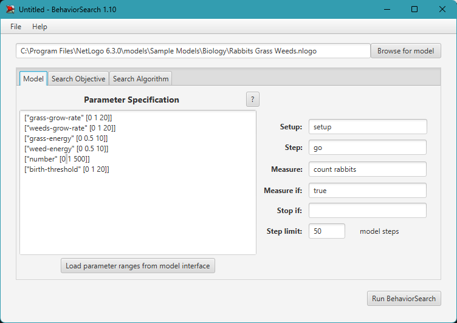
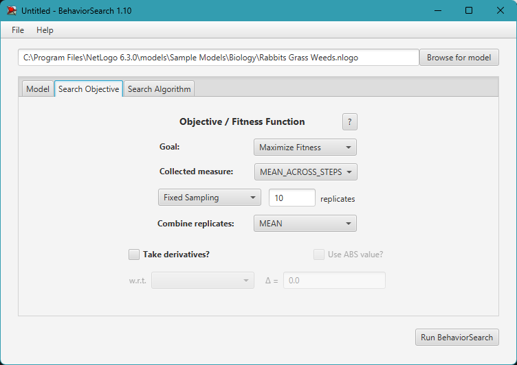
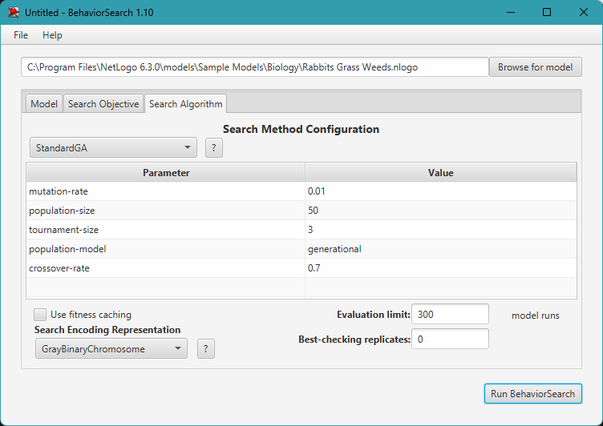
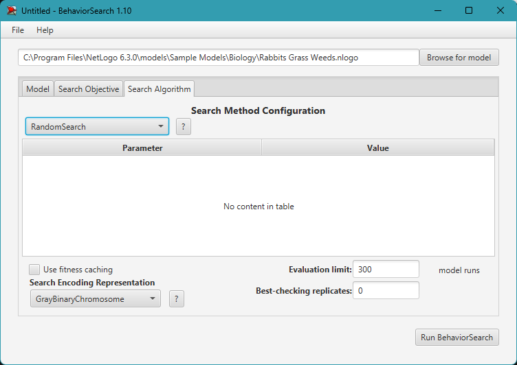
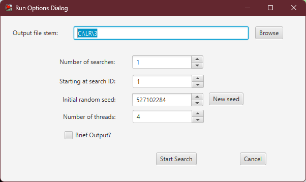
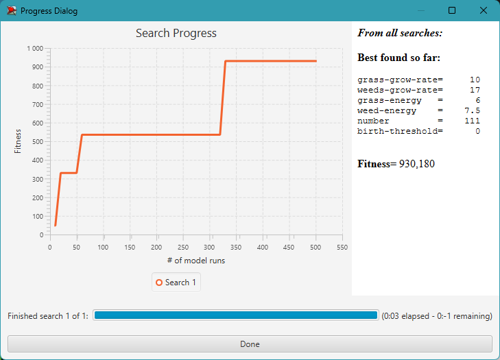
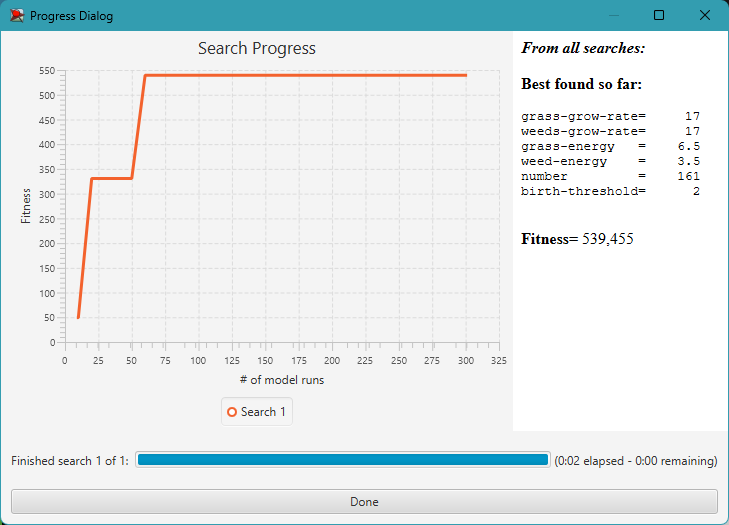

## Комп'ютерні системи імітаційного моделювання
## СПм-22-5, **Галицька Олександра Олегівна**
### Лабораторна робота №**3**. Використання засобів обчислювального интелекту для оптимізації імітаційних моделей

 

### Варіант 6, модель у середовищі NetLogo:
[Rabbits Grass Weeds](http://www.netlogoweb.org/launch#http://www.netlogoweb.org/assets/modelslib/Sample%20Models/Biology/Rabbits%20Grass%20Weeds.nlogo)

 

### Вербальний опис моделі:
Цей проект досліджує просту екосистему, що складається з кроликів, трави та бур’янів. Кролики блукають довкола випадковим чином, трава та бур’яни ростуть втпадковим чином. Коли кролик натикається на траву або бур’ян, він її поїдає і отримує енергію. Якщо кролик отримує достатньо енергії, він розмножується. Якщо він не отримує достатньо енергії, він вмирає. Траву та бур’яни можна налаштувати так, щоб вони росли з різною швидкістю та давали кроликам різну кількість енергії. Модель можна використовувати для дослідження конкурентних переваг цих змінних.

### Керуючі параметри:
- **number** - контролює початковою кількістю кроликів.
- **birth-threshold** - встановлює рівень енергії, при якому кролики розмножуються.
- **grass-growth-rate** - контролює швидкість, з якою росте трава.
- **weeds-growth-rate** - контролює швидкість росту бур'янів.
- **grass-energy** - Кількість енергії, що додає трава.
- **weed-energy** - Кількість енергії, що додає бур'ян.

### Показники роботи системи:
- **count rabbits** - Поточна кількість кроликів.
- **Population** - графік, що відображає кількісні парамтери **grass, rabbits, weeds**.

 

### Налаштування середовища BehaviorSearch:

**Обрана модель**:
<pre>
C:\Program Files\NetLogo 6.3.0\models\Sample Models\Biology\Rabbits Grass Weeds.nlogo
</pre>
**Параметри моделі** (вкладка Model):  
*Параметри та їх можливі діапазони були **автоматично** вилучені середовищем BehaviorSearch із вибраної імітаційної моделі, для цього є кнопка «Завантажити діапазони параметрів із інтерфейсу моделі»*:
<pre>
["grass-grow-rate" [0 1 20]]
["weeds-grow-rate" [0 1 20]]
["grass-energy" [0 0.5 10]]
["weed-energy" [0 0.5 10]]
["number" [0 1 500]]
["birth-threshold" [0 1 20]]
</pre> 
Використовувана **міра**:  
Для фітнес-функції *(вона ж функція пристосованості або цільова функція)* було обрано **значення середньої кількості кроликів**, у параметрі "**Measure**" вказано:
<pre>
count rabbits
</pre>
Середня кількість кроликів повинна враховуватися **в середньому** за весь період симуляції тривалістю, *для приклада*, 300 тактів, починаючи з 0 такту симуляції.  
*Параметр "**Mesure if**" зі значення true, по суті, і означає, що враховуватимуться всі такти симуляції, а чи не частина їх. Іноді має сенс не враховувати деякі такти через хаос в деяких моделях на початку їх використання. Наприклад, це показано в прикладі з документації BehaviorSearch.  
Параметри "**Setup**" та "**Go**" вказують відповідні процедури ініціалізації та запуску в логіці моделі (зазвичай вони так і називаються). BehaviorSearch в процесі роботи, по суті, замість користувача запускає ці процедури.*  
Параметр зупинки за умовою ("**Stop if**") у разі не використовувався.  
Загальний вигляд вкладки налаштувань параметрів моделі:  

**Налаштування цільової функції** (вкладка Search Objective):  
Метою підбору параметрів імітаційної моделі, є **максимізація** значення середньої кількості кроликів – це вказано через параметр "**Goal**" зі значенням **Maximize Fitness**. Тобто необхідно визначити такі параметри налаштувань моделі, у яких машини рухаються з максимальною швидкістю. При цьому цікавить не просто середня швидкість всіх машин у якийсь окремий момент симуляції, а середнє її значення за всю симуляцію (тривалість якої (500 кроків) вказувалася на минулій вкладці). Для цього у параметрі "**Collected measure**", що визначає спосіб обліку значень обраного показника, вказано **MEAN_ACROSS_STEPS**.  
Щоб уникнути викривлення результатів через випадкові значення, що використовуються в логіці самої імітаційної моделі, **кожна симуляція повторюється по 10 разів**, результуюче значення розраховується як **середнє арифметичне**.

Загальний вигляд вкладки налаштувань цільової функції:  

**Налаштування алгоритму пошуку** (вкладка Search Algorithm):

Загальний вид вкладки налаштувань алгоритму пошуку:

 

### Результати використання BehaviorSearch:

Діалогове вікно запуску пошуку: 

Результат пошуку параметрів імітаційної моделі, використовуючи **генетичний алгоритм**:  

Результат пошуку параметрів імітаційної моделі, використовуючи **випадковий пошук**:  

